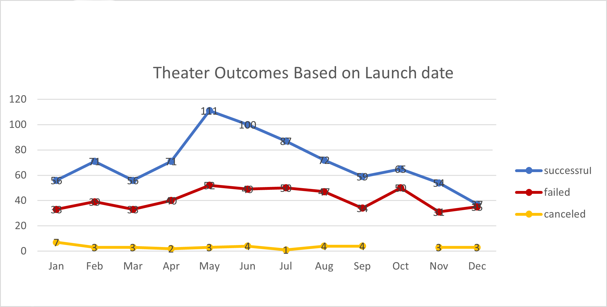
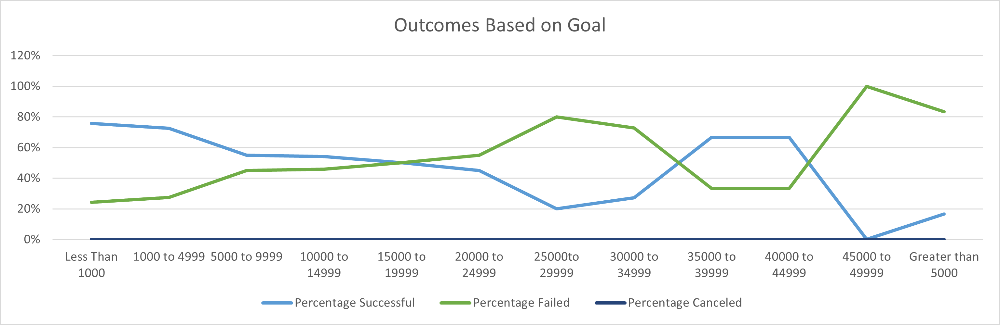

# Kickstarting with Excel

## Overview of Project

### Purpose
The purpose of this analysis is to visualize campaign outcomes based on their launch dates and their funding goals so that we can provide Louise with helpful insights about how other plays fared in relation to their launch dates and their funding goals.

## Analysis and Challenges

### Analysis of Outcomes Based on Launch Date 

The number of plays canceled was consistent, independently of launch date, which suggests that launch date is not a determining/contributor factor for cancellation.

There were more successful launches than failed.

It seems like there is a correlation between the number of successful and failed theaters, except for the period of Apr-Aug where there have been far more successful launches. Which suggests that the best launch date is within this period. May-June had been far the most successful period for launches.

On Dec, there has been as many successful as failed launches.

There are other factors that could have contributed to the success or failure of the launches that are not taken into account, as the country of launch 'audience preference etc'.

We are looking into the 2 factors launch date and goals separately. It would give us a better insight if both elements are combined in one graph.

### Analysis of Outcomes Based on Goals

The highest success rate was among the projects with a goal lower than 5000, followed by projects with a goal between 35000 and 45000

The percentage of failure got higher as the goal increased, up to 80% for the plays that had a goal between 25k to 35k.

ALL plays with a goal higher than 45k failed.

### Challenges and Difficulties Encountered

If we base on the above analysis, we can draw the conclusion that to maximise chances of success it is recommended to launch a play in the period of Apr-Aug with a goal low than 5,000. 

The goal and launch date may not be the only explanation for success or failure.

There are other factors that could be used in that analysis, like the country where the play is being produced, as it provides useful indication about public preferences. Launch dates could also be tied to some local events that would have explained the success or failure.

Another table that we could introduce is tiding up the plays launch dates to local events (Holidays, festivals..) in the country where they were launched to show the different outcomes based on launch timing (Are plays more likely to succeed if launched in a certain period, before or after major event...).
